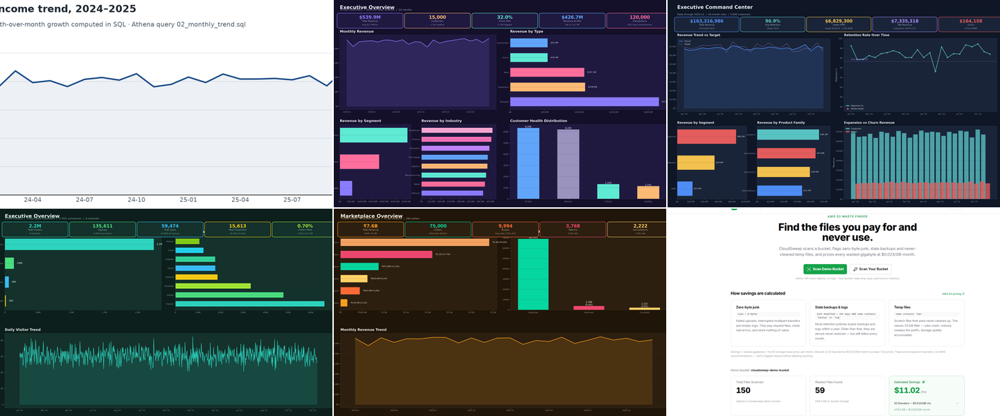

# Kavyanjali Karan

**Business Intelligence · SQL · Python · Power BI · AWS**

B.Tech Computer Science — ITER, SOA University (2027) · Bhubaneswar, India · Open to Relocate

[LinkedIn](https://linkedin.com/in/kavyanjali-karan) · [Email](mailto:karankavyanjali77@gmail.com)

*Every tile above is rendered from the repository it links to — click through for the live, reproducible version.*

---

Other small assets: [AWS](assets/aws.png) · [Retention](assets/retention.png) · [KPI](assets/kpi.png) · [Funnel](assets/funnel.png) · [Marketplace](assets/marketplace.png) · [CloudSweep](assets/cloudsweep.png)

---

## The pattern across my repositories

Every project answers one business question a stakeholder actually paid for, shows the SQL and Python that produced the answer, and ships the numbers with tests. Ask any headline number in these READMEs where it came from, and the answer is a query, not a screenshot.

| The business question | The number | The repo |
|---|---|---|
| "Which accounts do we save first?" | $54.27M churn vs $54.26M contraction — 50 accounts hold $611K ARR at risk | [Customer Retention Intelligence Platform](https://github.com/kavyanjali-karan/customer-retention-intelligence-platform) |
| "Which funnel stage is leaking?" | 2,243,206 visitors → 15,613 paying = 0.70% visitor-to-paid | [Growth Funnel Performance Review](https://github.com/kavyanjali-karan/growth-funnel-performance-review) |
| "Was Electronics really the big category?" | ₹3.4B of ₹7.6B (44.8%) — verified order-level, not category-level | [Marketplace Growth Performance Review](https://github.com/kavyanjali-karan/Marketplace-Growth-Performance-Review) |
| "Is a metric a number or a definition?" | 40 tests pin every executive metric to one governed definition | [Executive KPI Governance Platform](https://github.com/kavyanjali-karan/executive-kpi-governance-platform) |
| "Can this pipeline replace a 3-hour monthly ritual?" | 52,000 rows → Parquet → Athena SQL → QuickSight, tested end to end | [AWS Athena QuickSight Sales Analytics](https://github.com/kavyanjali-karan/aws-athena-quicksight-sales-analytics) |

Every repository carries CI, a passing test suite, and dashboards regenerated from the same data the README quotes — the live page and the screenshots can't disagree.

## How the work is built

- **Governed before visualized:** metrics are defined once in a dictionary or semantic layer, then every query, DAX measure, and chart reads from it.
- **Verified numbers:** each README's figures reconcile against the raw CSVs committed in the repo — the retention splits, the funnel counts, and the marketplace revenue were all reproduced from source data.
- **Reproducible by a stranger:** `pip install -r requirements.txt` and one script rebuilds the data, the tests, and the dashboards. Seeded generation, no manual steps.
- **Simulated data, real pipeline:** the datasets are labelled simulated and the engineering is production-style — the same discipline with real data, without anyone's customer records.

## Recognition

| Programme | Organisation | Year |
|---|---|---|
| Forward Program — Completed | McKinsey & Company | 2026 |
| DevTrails Hackathon — Seed 2 Qualifier | Guidewire Software | 2026 |
| Techgium — National Round 2 Qualifier | L&T Technology Services | 2025 |
| SQL 50 | LeetCode | 2026 |

## Certifications

- Fundamentals of Analytics (Part 1) — AWS SkillBuilder
- Tata GenAI Powered Data Analytics — Forage
- Deloitte Data Analytics Job Simulation — Forage
- AWS Solutions Architecture Job Simulation — Forage

---

[LinkedIn](https://linkedin.com/in/kavyanjali-karan) · [Email](mailto:karankavyanjali77@gmail.com)
